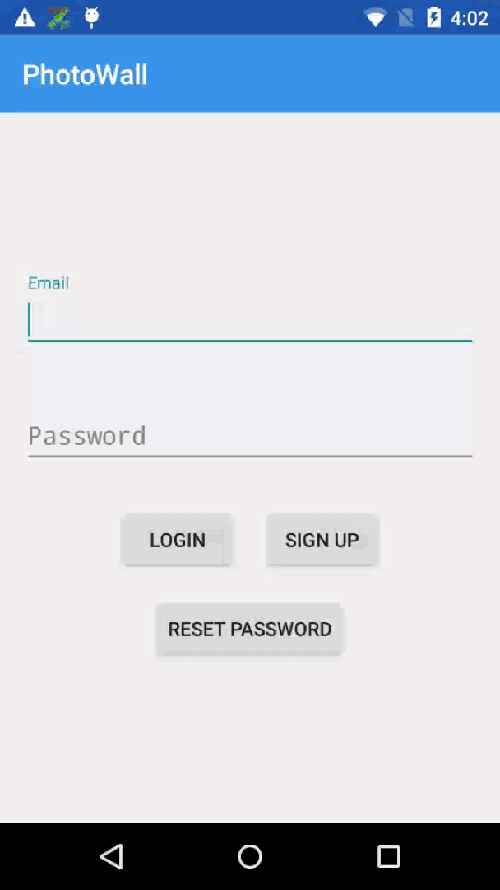

# Sample-PhotoWall-Android

Sample-PhotoWall-Android

## 简介

PhotoWall 是 MaxLeap SDK 的一个 Sample，该项目依赖于 MaxLeap 的基础模块。通过该应用你可以上传照片，浏览附近十公里内分享过的照片以及所有照片。同时也可以学习和了解基于 MaxLeap SDK 的 Cloud Data 相关的操作，包括以下几部分：

- 如何进行注册，登陆，重置密码
- 如何使用 Public File 功能进行图片的上传和下载
- 如何使用 GeoPoint 获得并保存当前的位置信息
- 如何使用 GeoPoint 的 Query 语句
- 如何在 ListView 中展示来自 MaxLeap Server 的数据

## 效果

## 使用

1. 前往 [MaxLeap 开发者控制台](https://maxleap.cn)，创建一个 Android 应用，获得你自己的 `APP ID` 和 `API KEY`。

2. 打开 Android Studio 或 IDEA ，点击菜单项 `File -> Open ` 选择 `setting.gradle` 文件导入工程.

3. 打开 `App.java` 文件，使用你自己的 `APP Id` 和 `API KEY` 替换该文件中已定义的同名常量。

4. 在 [MaxLeap 开发者控制台](https://maxleap.cn) 跳转到开发者中心页面，创建以下必要的表结构

	**表名**：Photos

	列名 | 类型
    -----|-----
    title | String
    location | GeoPoint
    attachment | File

5. 运行应用